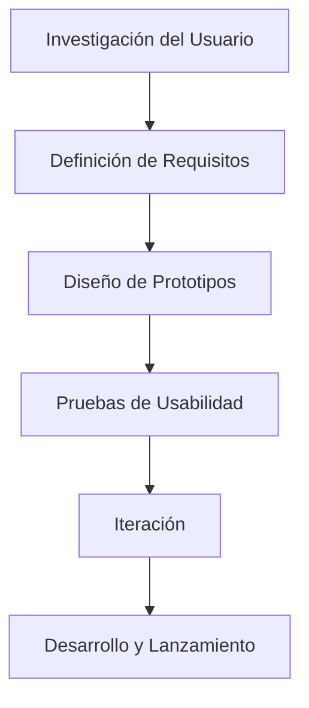

### Concepto de Diseño Centrado en el Usuario

El **Diseño Centrado en el Usuario (DCU)** es fundamental en todo proceso de desarrollo. Como profesor, siempre recalco que este enfoque pone al usuario en el centro, garantizando que la interfaz sea intuitiva y fácil de usar. Esto significa que el producto no solo debe ser visualmente atractivo, sino también eficiente y eficaz para quienes lo van a utilizar. Lo vemos claramente en aplicaciones como **WhatsApp**, donde todo gira alrededor de las necesidades de comunicación rápida del usuario.

Los **principios del DCU** son claros:

- **Enfoque en el usuario desde el inicio**: Desde el principio, las decisiones de diseño giran en torno al usuario.
- **Pruebas y retroalimentación continua**: A lo largo del desarrollo, realizamos pruebas con usuarios reales.
- **Iteración del diseño**: Adaptamos el diseño continuamente basándonos en el feedback.

### Etapas del Proceso de DCU

El **proceso de Diseño Centrado en el Usuario** se estructura en varias etapas, que deben repetirse para asegurar un diseño centrado en las necesidades del usuario.

#### Etapas

1. **Investigación del Usuario**  
   El primer paso es entender quién va a utilizar el producto. Usamos **personas**, que son representaciones de los usuarios reales, para crear perfiles detallados.

2. **Definición de Requisitos**  
   Basándonos en esa investigación, establecemos los requisitos que se alinean con la experiencia de usuario, como facilidad de uso o accesibilidad.

3. **Diseño de Prototipos**  
   Creamos prototipos de baja o alta fidelidad (desde wireframes simples hasta simulaciones interactivas), lo que permite realizar pruebas tempranas.

4. **Pruebas de Usabilidad**  
   Evaluamos los prototipos con usuarios reales para identificar posibles problemas y hacer ajustes antes de la implementación definitiva.

5. **Iteración**  
   Mejoramos el diseño según los resultados de las pruebas, afinando hasta que sea óptimo para los usuarios.

6. **Desarrollo y Lanzamiento**  
   Con el diseño validado, desarrollamos el producto y lo lanzamos al mercado. Aún después del lanzamiento, seguimos recopilando feedback.

### Herramientas y Técnicas para Aplicar DCU

Durante el proceso de Diseño Centrado en el Usuario (DCU), utilizamos una serie de herramientas y técnicas que nos permiten entender mejor a nuestros usuarios y mejorar su experiencia. Aquí os dejo algunas de las más comunes:

| **Herramienta**            | **Descripción**                                                                                         | **Imagen**                                                                                                                                                         |
|----------------------------|---------------------------------------------------------------------------------------------------------|--------------------------------------------------------------------------------------------------------------------------------------------------------------------|
| **Personas**                | Perfiles ficticios que nos ayudan a visualizar las características y comportamientos de los usuarios.    |                                                                                          |
| **Mapas de Empatía**        | Nos permiten profundizar en las emociones y pensamientos de los usuarios para comprender mejor sus necesidades. |                                                                       |
| **Wireframes y Prototipos** | Los wireframes son esquemas simples de la interfaz, y los prototipos permiten evaluar la interacción con el sistema. |                                             |
| **Pruebas de Usabilidad**   | Observamos cómo interactúan los usuarios con el producto para identificar problemas y mejorar la experiencia.  |  |
| **Entrevistas y Encuestas** | Recopilamos información directamente de los usuarios para ajustar el producto según sus experiencias y necesidades.  |                                                                 |
| **Card Sorting**            | Técnica que ayuda a entender cómo los usuarios organizan la información, útil para diseñar una navegación clara. |                            |

Estas herramientas son esenciales para asegurar que el diseño de las interfaces sea funcional, accesible y realmente centrado en las necesidades del usuario final.