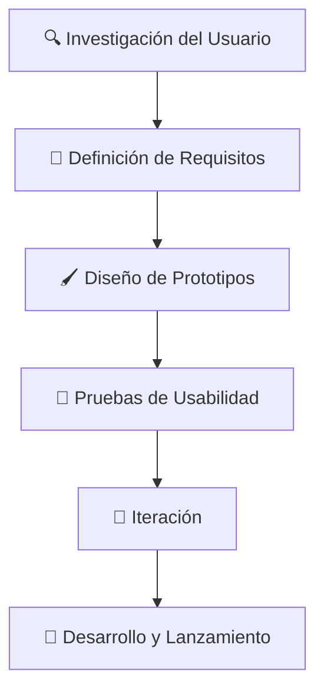

# 🚀 Diseño Centrado en el Usuario: ¡Diseña Pensando en las Personas! 👥

El **Diseño Centrado en el Usuario (DCU)** es la clave para crear productos que no solo se vean geniales, sino que **funcionen perfectamente** para quienes los utilizan. No es suficiente con que una aplicación luzca bonita; debe ser **intuitiva**, **eficaz**, y, sobre todo, debe **resolver las necesidades del usuario** de manera sencilla y rápida. Aplicaciones como **WhatsApp** son un ejemplo perfecto: todo está diseñado para facilitar la comunicación rápida y fácil. 📱💬

---

## 🔍 **¿Qué es el Diseño Centrado en el Usuario?**

El **DCU** significa poner al usuario en el centro de cada decisión de diseño. En lugar de diseñar basándonos en suposiciones, diseñamos según lo que los **usuarios realmente necesitan**. ¡Es un enfoque que cambia las reglas del juego! 🎮

### 🌟 **Principios del DCU:**

- **👤 Enfoque en el usuario desde el inicio**: Todo se centra en entender y satisfacer las necesidades del usuario.
- **🔄 Pruebas continuas**: Recolectamos feedback real a lo largo de todo el proceso para garantizar que el producto sea relevante.
- **♻️ Iteración constante**: Mejoramos el diseño continuamente en base al feedback y los resultados de pruebas.

---

## 🛤️ **El Proceso del DCU: ¡Una Ruta Directa al Éxito!** 🏆

El **Diseño Centrado en el Usuario** sigue un proceso cíclico que garantiza la optimización en cada fase: investigar, diseñar, probar, mejorar y lanzar. Este ciclo se repite hasta que cada detalle esté afinado al máximo. 🔄

---

### 🚦 **Etapas del Proceso de DCU**

1. **🔍 Investigación del Usuario**  
   El primer paso es entender quiénes van a usar nuestro producto. Creamos **personas** ficticias que representan a los usuarios reales para guiarnos en el diseño. ¡Conócelos como a tus mejores amigos! 👫

2. **📝 Definición de Requisitos**  
   Basándonos en la investigación, definimos los requisitos clave que garantizarán una experiencia de usuario impecable, como accesibilidad y facilidad de uso. 📋

3. **🖌️ Diseño de Prototipos**  
   Aquí es donde comienza la magia visual. Desde simples bocetos (**wireframes**) hasta simulaciones interactivas, probamos nuestras ideas desde el principio para ver qué funciona mejor. ✨

4. **🧪 Pruebas de Usabilidad**  
   Ponemos nuestros prototipos a prueba con usuarios reales. Esta es la fase donde descubrimos qué ajustes necesitamos hacer antes de lanzarlo al mundo. 🔍

5. **🔄 Iteración**  
   Tomamos el feedback y refinamos el diseño una y otra vez, hasta que sea perfecto para los usuarios. ¡No nos conformamos con menos! 🔧

6. **🚀 Desarrollo y Lanzamiento**  
   Una vez que todo está validado, es hora de llevar el producto al mercado. ¡Pero no termina ahí! Continuamos recopilando feedback para seguir mejorando. 📈

---

## 🛠️ **Herramientas y Técnicas para el DCU: ¡Tus Aliados para Diseñar Mejor!** 🧰

Para implementar el **Diseño Centrado en el Usuario**, usamos una variedad de herramientas y técnicas que nos ayudan a comprender mejor a nuestros usuarios y mejorar continuamente la experiencia de usuario.

### 🧩 **Herramientas Clave del DCU**

- **🕵️‍♂️ Personas**  
  Creación de perfiles ficticios que reflejan las características y comportamientos de nuestros usuarios. Son la base para entender a quién estamos diseñando.  

- **💭 Mapas de Empatía**  
  Visualizan las emociones, pensamientos y necesidades de los usuarios, ayudándonos a ponernos en su lugar.  

- **📐 Wireframes y Prototipos**  
  Los wireframes son bocetos simples del diseño; los prototipos permiten probar la interacción real con el sistema, facilitando los ajustes necesarios antes del desarrollo.  

- **🧪 Pruebas de Usabilidad**  
  Evaluamos cómo interactúan los usuarios con el producto para detectar problemas y optimizar la experiencia. ¡Nada mejor que el feedback directo!  

- **🎤 Entrevistas y Encuestas**  
  Recogemos información directa de los usuarios para ajustar el producto según sus necesidades y expectativas. ¡Conecta con ellos para crear algo que realmente amen!  

- **🗂️ Card Sorting**  
  Técnica que muestra cómo los usuarios organizan la información, lo que es fundamental para diseñar una navegación clara e intuitiva.  

---

### 🚀 **¡Manos a la Obra!**

El **Diseño Centrado en el Usuario** es mucho más que un proceso; es una **filosofía** que asegura que lo que estamos construyendo realmente beneficie a las personas. Utilizando estas herramientas y técnicas, garantizamos que nuestras interfaces no solo sean funcionales, sino que también se conviertan en **experiencias memorables** para los usuarios. 🏅

¡Diseña pensando en las personas y crea productos que realmente cambien vidas! 🌟