# Introducción a Angular 18: La Revolución en el Desarrollo Web 🚀

Angular 18 ha llegado, y con él, una nueva ola de posibilidades para desarrolladores que buscan crear aplicaciones web robustas, escalables y modernas. Si estás listo para sumergirte en esta versión mejorada de uno de los frameworks más populares del mundo, ¡este es el lugar para comenzar! Vamos a explorar desde los conceptos básicos hasta la estructura de un proyecto en Angular 18. 

---

## ¿Qué es Angular? 🤔
Angular es un **framework** de código abierto desarrollado por Google, diseñado específicamente para construir aplicaciones web de una sola página (SPA). Utiliza **TypeScript**, lo que permite a los desarrolladores aprovechar características modernas como tipado estático y herramientas avanzadas.

En palabras simples, **Angular** te ayuda a estructurar tu código de una manera eficiente, modular y escalable.

---

## Historia y Evolución del Framework 📜
Angular ha recorrido un largo camino desde su lanzamiento inicial en 2010. **AngularJS** fue la primera versión, que marcó el comienzo de una nueva era para los desarrolladores web. Sin embargo, con la evolución de las necesidades del mercado, Google reescribió completamente el framework, lanzando lo que hoy conocemos como Angular 2+. Desde entonces, cada nueva versión ha traído mejoras significativas en términos de rendimiento, características y herramientas de desarrollo.

### Línea de Tiempo Angular:

```mermaid
graph LR;
    AngularJS --> Angular2;
    Angular2 --> Angular4;
    Angular4 --> Angular5;
    Angular5 --> Angular6;
    Angular6 --> Angular7;
    Angular7 --> Angular8;
    Angular8 --> Angular9;
    Angular9 --> Angular10;
    Angular10 --> Angular11;
    Angular11 --> Angular12;
    Angular12 --> Angular13;
    Angular13 --> Angular14;
    Angular14 --> Angular15;
    Angular15 --> Angular16;
    Angular16 --> Angular17;
    Angular17 --> Angular18;
```

¡Angular no deja de mejorar! 🚀

---

## Angular vs. Otros Frameworks: React, Vue 🥊
Si bien Angular tiene una competencia fuerte en **React** (creado por Facebook) y **Vue.js** (creado por Evan You), Angular se destaca por ser una **solución completa** para el desarrollo web. Mientras que frameworks como **React** se centran solo en la vista, Angular ofrece un enfoque integral que incluye el manejo de servicios, rutas, formularios y mucho más.

### Comparación:
| Característica          | Angular 18  | React       | Vue.js      |
|-------------------------|-------------|-------------|-------------|
| Lenguaje principal       | TypeScript  | JavaScript  | JavaScript  |
| Complejidad inicial      | Alta        | Media       | Baja        |
| Comunidad y soporte      | Muy amplio  | Muy amplio  | Amplio      |
| Curva de aprendizaje     | Pronunciada | Moderada    | Suave       |
| Enfoque                  | Completo    | Solo UI     | Flexible    |

---

## Características y Ventajas de Usar Angular 🏆
- **Modularidad:** Angular permite dividir tu aplicación en módulos, facilitando el mantenimiento y escalabilidad.
- **TypeScript:** Mejora el desarrollo con tipado estático, mejor autocompletado y detección de errores antes de ejecutar el código.
- **Inyección de Dependencias:** Facilita la gestión de dependencias y promueve la reutilización del código.
- **Componentes Reutilizables:** La arquitectura basada en componentes permite crear elementos de UI reutilizables en toda la aplicación.
- **Rendimiento Optimizado:** Angular utiliza técnicas de optimización como **tree-shaking** y **lazy loading** para mejorar la carga de las aplicaciones.
  
---

## Casos de Uso: ¿Cuándo Usar Angular? 🛠️
Angular es ideal para aplicaciones web a gran escala que requieren una estructura sólida y escalable. Algunos ejemplos de proyectos donde Angular brilla incluyen:

- **Dashboards empresariales**
- **Aplicaciones SaaS (Software as a Service)**
- **Aplicaciones de comercio electrónico**
- **Plataformas de educación en línea**
- **Aplicaciones móviles (a través de Ionic o NativeScript)**

---

## Instalación y Configuración de Angular ⚙️

Instalar Angular es pan comido. Sigue estos sencillos pasos para tener tu entorno de desarrollo listo:

1. Asegúrate de tener instalado **Node.js**.
2. Instala Angular CLI globalmente en tu máquina:
    ```bash
    npm install -g @angular/cli
    ```
3. Verifica que la instalación haya sido exitosa:
    ```bash
    ng --version
    ```

Ahora estás listo para crear tu primer proyecto en Angular 18.

---

## Primer Proyecto con Angular 🎯
¡Manos a la obra! Sigamos con la creación de nuestro primer proyecto Angular:

1. Crea un nuevo proyecto:
    ```bash
    ng new mi-primer-proyecto
    ```
2. Navega al directorio del proyecto:
    ```bash
    cd mi-primer-proyecto
    ```
3. Arranca el servidor de desarrollo:
    ```bash
    ng serve
    ```

¡Y listo! Ahora puedes acceder a tu aplicación en `http://localhost:4200/`.

---

## Estructura de un Proyecto Angular 📂

Un proyecto en Angular está bien organizado en diferentes carpetas y archivos, lo que facilita la escalabilidad a medida que crece tu aplicación. Esta es la estructura básica de un proyecto:

```bash
mi-proyecto/
│
├── src/
│   ├── app/
│   │   ├── app.component.ts   # Componente principal
│   │   ├── app.module.ts      # Módulo principal
│   │   └── ...                # Otros componentes, servicios, etc.
│   ├── assets/                # Recursos estáticos (imágenes, fuentes, etc.)
│   ├── environments/          # Configuraciones de entorno
│   ├── main.ts                # Punto de entrada de la aplicación
│   └── ...                    # Otros archivos de configuración
│
├── angular.json               # Configuración del proyecto Angular
├── package.json               # Dependencias del proyecto
└── ...

```

---

Con estos primeros pasos ya tienes una base sólida para empezar a trabajar con Angular 18. Desde su instalación hasta la creación de un proyecto, estás listo para aprovechar las ventajas de este framework increíblemente poderoso. 🎉