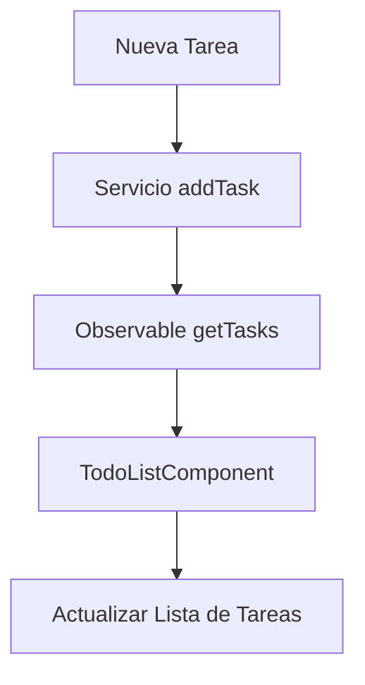

# Proyecto To-Do List con Angular 18 🚀

Este es un proyecto simple pero efectivo de una **lista de tareas (To-Do List)**, desarrollado en **Angular 18**. El proyecto se basa en componentes modulares de Angular y hace uso de observables de **RxJS** para gestionar la comunicación entre los servicios y los componentes. A continuación, te explicaré cómo funciona este proyecto y qué hace cada parte del código.

---

## Estructura del Proyecto

Este proyecto tiene las siguientes clases clave:

1. **TodoListComponent** (`todo-list.component.ts`)
2. **Task** (`task.ts`)
3. **TodoService** (`todo-list.service.ts`)

Además, se utiliza **RxJS** para manejar los datos asíncronos de las tareas.

---

## 1. **TodoListComponent**

Esta es la clase principal que maneja la lógica de la lista de tareas y su representación en el HTML. Aquí tienes el código para que puedas visualizarlo mejor:

```typescript
// todo-list.component.ts
import { Component, OnInit } from '@angular/core';
import { TodoService } from '../../services/todo-list.service';
import { Task } from '../../models/task';
import { FormsModule } from '@angular/forms';
import { CommonModule } from '@angular/common';

@Component({
  selector: 'app-todo-list',
  standalone: true,
  imports: [FormsModule, CommonModule],
  templateUrl: './todo-list.component.html',
  styleUrls: ['./todo-list.component.css']
})
export class TodoListComponent implements OnInit {
  tasks: Task[] = [];
  newTaskTitle: string = '';

  constructor(private todoService: TodoService) { }

  ngOnInit(): void {
    this.todoService.getTasks().subscribe(tasks => {
      this.tasks = tasks;
    });
  }

  addTask(): void {
    if (this.newTaskTitle.trim()) {
      this.todoService.addTask(this.newTaskTitle);
      this.newTaskTitle = '';
    }
  }
}
```

### Puntos clave:
- **Data binding**: Usamos `[(ngModel)]` para realizar el binding de los datos en los formularios de Angular.
- **Observables**: La función `ngOnInit` se suscribe a los cambios de las tareas a través del servicio `TodoService`.
- **addTask**: Método que añade nuevas tareas a la lista, siempre y cuando el campo de entrada no esté vacío.

---

## 2. **Template (HTML)**

El HTML correspondiente a este componente gestiona la interfaz gráfica de la lista de tareas. Contiene un formulario simple para añadir tareas y una lista que las despliega.

```html
<!-- todo-list.component.html -->
<div class="todo-list">
    <h1>To-Do List</h1>

    <!-- Formulario para añadir nueva tarea -->
    <input type="text" [(ngModel)]="newTaskTitle" placeholder="Nueva tarea" />
    <button (click)="addTask()">Añadir Tarea</button>

    <!-- Lista de tareas -->
    <ul>
        <li *ngFor="let task of tasks">
            <input type="checkbox" [(ngModel)]="task.completed" />
            {{ task.title }}
        </li>
    </ul>
</div>
```

### Puntos clave:
- **Directiva `*ngFor`**: Genera dinámicamente la lista de tareas a partir del array `tasks`.
- **Binding en el checkbox**: La propiedad `[(ngModel)]` está vinculada al estado de la tarea, lo que permite marcar las tareas como completadas.

---

## 3. **Modelo de Tarea (`task.ts`)**

La interfaz `Task` es muy simple. Define la estructura de los objetos que representan las tareas:

```typescript
// task.ts
export interface Task {
    id: number;
    title: string;
    completed: boolean;
}
```

Cada tarea tiene un `id`, un `title` y un `completed` para gestionar si la tarea ha sido completada.

---

## 4. **Servicio TodoService (`todo-list.service.ts`)**

Este servicio es responsable de gestionar la lista de tareas. Aquí es donde entran los **observables** de **RxJS** para devolver las tareas como un flujo de datos.

```typescript
// todo-list.service.ts
import { Injectable } from '@angular/core';
import { Observable, of } from 'rxjs';
import { Task } from '../models/task';

@Injectable({
  providedIn: 'root'
})
export class TodoService {
  private tasks: Task[] = [
    { id: 1, title: 'Task 1', completed: false },
    { id: 2, title: 'Task 2', completed: true },
    { id: 3, title: 'Task 3', completed: false }
  ];

  constructor() { }

  getTasks(): Observable<Task[]> {
    return of(this.tasks);
  }

  addTask(title: string): void {
    const newTask: Task = {
      id: this.tasks.length + 1,
      title: title,
      completed: false
    };
    this.tasks.push(newTask);
  }
}
```

### Puntos clave:
- **Observable**: Utilizamos el método `of` de **RxJS** para crear un observable a partir de un array de tareas.
- **addTask**: Permite añadir una nueva tarea al array de tareas locales, incrementando el `id` y añadiendo el título proporcionado.

---

## Observables y `of` en RxJS 📡

En este proyecto, el **Observable** es clave para manejar datos de manera asíncrona. **RxJS** es una librería que Angular utiliza para manejar flujos de datos. En este caso, usamos el método `of` para emitir un array de tareas como un flujo de datos.

```typescript
getTasks(): Observable<Task[]> {
  return of(this.tasks);
}
```

### ¿Qué es `of`?
El operador `of` de **RxJS** crea un observable a partir de cualquier cosa que le pases, en este caso, un array de tareas. Este flujo de datos puede ser observado (`subscribe`) por otros componentes como `TodoListComponent`, permitiendo que se actualicen automáticamente cuando hay cambios en los datos.

---

## Diagrama de flujo 🧩 (Mermaid)
Aquí tienes un diagrama que resume el flujo de cómo se maneja una nueva tarea en este proyecto:



---

## Conclusión

Este proyecto simple pero eficaz te ofrece una **lista de tareas** totalmente funcional utilizando **Angular 18** y **RxJS**. La arquitectura modular facilita la escalabilidad y el mantenimiento, permitiendo que puedas seguir añadiendo funcionalidades como la persistencia de datos o la integración con una API backend.

¡Espero que esta explicación te haya servido para comprender mejor cómo se organiza este proyecto! 💻