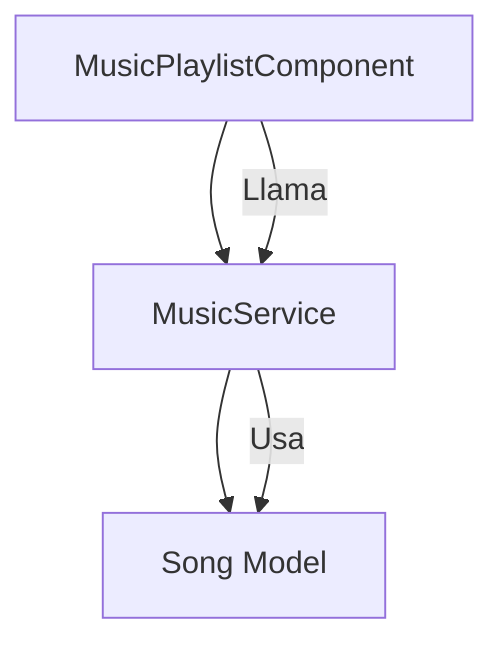

### Ejercicio: Lista de Reproducción de Música 🎵

En este ejercicio, desarrollarás una **lista de reproducción de música** similar a una lista de tareas, pero con canciones en lugar de tareas. Los usuarios podrán agregar canciones a la lista, ver las canciones actuales y marcar canciones como "reproducidas". Trabajarás con **componentes personalizados** y un **servicio** que proporcionará los datos de las canciones utilizando un **observable**.

#### Objetivos:
1. Crear un **componente personalizado** para manejar la lista de reproducción.
2. Crear un **servicio** que provea las canciones mediante un **observable**.
3. Implementar un **formulario** para agregar nuevas canciones a la lista usando **binding**.
4. Permitir que los usuarios marquen canciones como "reproducidas".
5. Renderizar la lista de canciones de forma dinámica.

---

### Estructura del Proyecto

1. **Componente de Lista de Reproducción**: El componente `MusicPlaylistComponent` será el responsable de manejar la lista de reproducción de canciones, permitiendo a los usuarios agregar nuevas canciones y marcar canciones como reproducidas.

2. **Modelo de Canción**: La interfaz `Song` definirá la estructura de las canciones en la lista de reproducción. Cada canción tendrá un título, un ID único y un estado que indicará si ha sido reproducida o no.

3. **Servicio de Música**: El servicio `MusicService` proporcionará la lista de canciones mediante un **observable** y permitirá agregar nuevas canciones. Este servicio simulará la obtención de datos desde una fuente externa.

---

### 1. **Componente: MusicPlaylistComponent**

Debes crear un componente que:

- Contenga un formulario que permita a los usuarios agregar una nueva canción a la lista.
- Renderice una lista de canciones.
- Permita marcar canciones como "reproducidas".

---

### 2. **Plantilla HTML**

La plantilla HTML debe contener:

- Un campo de texto y un botón para que el usuario pueda añadir una nueva canción a la lista.
- Una lista que muestre las canciones actuales.
- Un checkbox al lado de cada canción para marcarla como reproducida.

---

### 3. **Modelo: Song**

Debes crear una interfaz `Song` que incluya:

- `id`: Un número único para identificar la canción.
- `title`: El título de la canción.
- `played`: Un valor booleano que indique si la canción ha sido reproducida o no.

---

### 4. **Servicio: MusicService**

Crea un servicio que:

- Proporcione una lista inicial de canciones.
- Permita agregar nuevas canciones a la lista.
- Utilice un **observable** para devolver la lista de canciones y cualquier cambio que se haga en ella.

---

### Funcionalidades Clave:
1. **Añadir canciones**: Los usuarios deben poder agregar nuevas canciones a la lista a través de un formulario.
2. **Marcar canciones como reproducidas**: Los usuarios podrán marcar las canciones como reproducidas usando un checkbox.
3. **Renderizado dinámico**: La lista de canciones debe actualizarse automáticamente cuando se añadan nuevas canciones o se marquen como reproducidas.

---

### Desafíos Adicionales:
1. **Filtrar canciones**: Implementa una funcionalidad para filtrar las canciones reproducidas o no reproducidas.
2. **Eliminar canciones**: Añade la posibilidad de eliminar canciones de la lista.

---

### Diagrama de aclaratorio
