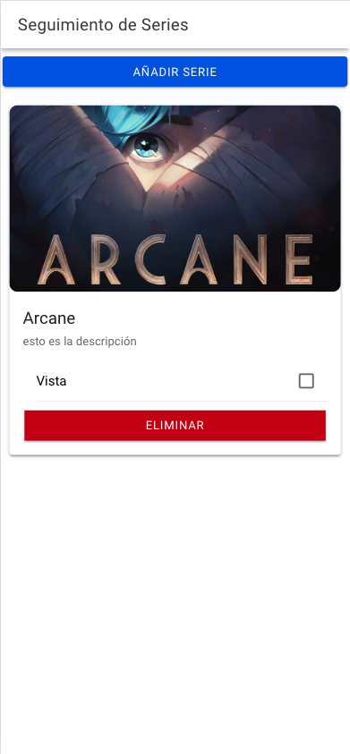

# **Tarea: Seguimiento de Películas o Series**  

**Objetivo:**  
Desarrollar una pantalla que permita a los usuarios gestionar una lista de películas o series en las que puedan:  

   - Ver un resumen de las series/películas registradas.  
   - Marcar como vistas aquellas ya completadas.  
   - Añadir nuevos títulos o eliminar los existentes.  

**Requisitos Técnicos:**  
La pantalla debe construirse utilizando **Ionic** y los componentes específicos proporcionados en los recursos.  

## **Descripción de la Tarea:**  

1. **Pantalla Principal**  
      - Crea una interfaz que muestre una lista de películas o series.  
      - Cada película o serie debe representarse mediante un `ion-card`, que incluirá:  
         - Título.  
         - Descripción breve.  
         - Imagen (puedes usar un placeholder como `https://via.placeholder.com/150`).  
         - Un `ion-checkbox` para indicar si el usuario ya la ha visto.  

2. **Funcionalidades Básicas**  
      - Los usuarios deben poder añadir nuevos títulos.  
      - Al marcar el checkbox de una película o serie como "vista", el título debe cambiar visualmente (puedes aplicar un estilo tachado o cambiar el color).  
      - Deben poder eliminar un título de la lista.  

3. **Botones**  
      - Incluye un botón "Añadir" para abrir un modal o formulario donde el usuario pueda agregar el título, descripción e imagen de la película o serie.  
      - Incluye un botón "Eliminar" en cada tarjeta para permitir al usuario eliminar un elemento específico.  

4. **Estilo y Diseño**  
      - Usa `ion-list` para organizar los elementos, según prefieras.  
      - Aplica estilos personalizados utilizando CSS o SCSS para mejorar la interfaz.  

## **Recursos**  

- [Documentación de Cards](https://ionicframework.com/docs/api/card): Aprende cómo estructurar y personalizar tarjetas para mostrar los datos de cada película o serie.  
- [Documentación de Checkboxs](https://ionicframework.com/docs/api/checkbox): Descubre cómo implementar checkboxes para permitir a los usuarios marcar elementos como vistos.  
- [Documentación de Buttons](https://ionicframework.com/docs/api/button): Utiliza botones para añadir y eliminar elementos fácilmente.  
- [Documentación de Lists](https://ionicframework.com/docs/api/list): Utiliza listas para mostrar una lista de películas o series.

## **Ejemplo de Captura de la App**

